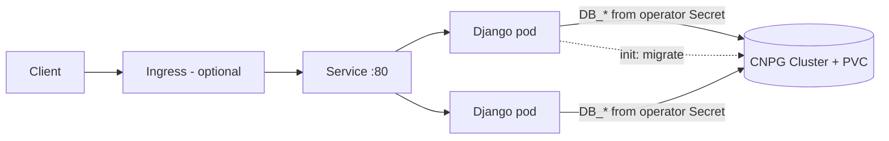

# django-helm

Standalone Helm chart for Django + PostgreSQL. The database is either **CloudNativePG** (default) or an **external** database. Image: `docker.io/vaymen/django-app:<commit-id>` ([source](https://github.com/vaymen/django-app-Exam)).



## What the chart creates

Deployment (with a migration init container), Service, ConfigMap, Secret (auto-generated, stable `SECRET_KEY`), ServiceAccount, PodDisruptionBudget, CNPG `Cluster` (optional), Ingress and HPA (optional).

## Prerequisites

Kubernetes ≥ 1.27, Helm 3, a default StorageClass, and the CloudNativePG operator (unless `database.mode=external`).

```bash
helm repo add cnpg https://cloudnative-pg.github.io/charts && helm repo update
helm upgrade --install cnpg cnpg/cloudnative-pg -n cnpg-system --create-namespace --wait
```

> The latest operator chart requires Kubernetes **≥ 1.29**. On older clusters install an older chart version: `helm search repo cnpg/cloudnative-pg --versions`, pick one whose `kubeVersion` fits, and pass `--version <it>`.

## Quick start (local: kind, minikube, Docker Desktop)

```bash
helm upgrade --install django-app . -n django --create-namespace \
  -f values-local.yaml --wait --timeout 10m
kubectl -n django port-forward svc/django-app 8080:80      # http://localhost:8080
```

## Installing in different environments

| Environment | Command / settings |
|---|---|
| **kind / minikube / Docker Desktop** | `-f values-local.yaml` (one replica, no PDB). Pulls from Docker Hub; for a local image use `kind load docker-image <image> --name <cluster>` |
| **Cloud (EKS, GKE, AKS)** | `-f values-production.yaml`: 3 replicas, Ingress with TLS, 3-instance CNPG cluster, HPA, topology spread. Adjust `ingress.className` and hostnames |
| **External database (RDS, Cloud SQL, ...)** | `--set database.mode=external --set database.credentialsSecret.name=my-db`; the Secret needs the keys `host, port, dbname, username, password` (key names are configurable) |
| **Private registry** | `kubectl create secret docker-registry regcred ...` then `--set 'imagePullSecrets[0].name=regcred'` |
| **Air-gapped** | mirror the image to an internal registry and set `image.repository` |
| **Bring your own Django secret** | `--set secret.existingSecret=my-secret` (key `DJANGO_SECRET_KEY`) |
| **No ingress controller** | `kubectl port-forward`, or `service.type=LoadBalancer` / `NodePort` |

### Key values

| Value | Default | Notes |
|---|---|---|
| `image.repository` / `image.tag` | `docker.io/vaymen/django-app` / commit id | tag = commit id |
| `replicaCount` | `2` | ignored when `autoscaling.enabled` |
| `django.allowedHosts` | **required** | `"*"` is rejected on purpose |
| `django.csrfTrustedOrigins` | `""` | e.g. `https://app.example.com` |
| `resources` | req 100m / 128Mi, limit 256Mi | |
| `database.mode` | `cnpg` | or `external` |
| `database.cnpg.instances` / `.storage.size` | `1` / `5Gi` | use `3` for HA |
| `migrate.enabled` | `true` | run `migrate` in an init container |

> `--set` treats a comma as a separator. For several hosts use a values file, or `--set-string 'django.allowedHosts=a\,b'`.

## Verification

```bash
kubectl -n django get cluster,pods,svc,pvc          # Cluster healthy, pod 1/1 Running, PVC Bound
kubectl -n django rollout status deploy/django-app
curl -i localhost:8080/                              # welcome page
curl -i localhost:8080/readyz                        # 200 and "database":"ok"
kubectl -n django logs deploy/django-app -c migrate  # applied migrations
kubectl -n django delete pod -l app.kubernetes.io/name=django-app   # comes back Ready
```

Resource names: if the release name already contains `django-app`, the full name equals the release name (`django-app`); otherwise it is `<release>-django-app`.

## Troubleshooting

| Symptom | Cause |
|---|---|
| `ImagePullBackOff` | image not on the registry, or it is private |
| `no matches for kind "Cluster"` | CloudNativePG operator is not installed |
| `chart requires kubeVersion` | operator chart is too new for your Kubernetes (see above) |
| `Missing required value: django.allowedHosts` | set `django.allowedHosts` |
| PVC stuck in `Pending` | no default StorageClass; set `database.cnpg.storage.storageClass` |
| `failed parsing --set data` | comma inside `--set`; use a values file |
| `\` line continuation fails in PowerShell | `\` is bash-only; use a backtick or a single line |

## Design decisions

- **CloudNativePG.** Persistent storage, generated credentials and failover without a hand-written StatefulSet. The `external` mode covers databases that live elsewhere.
- **Probes.** A startup probe handles slow starts; liveness uses `/healthz` (no database dependency, so an outage cannot cause a restart loop); readiness uses `/readyz` (database required).
- **Migrations in an init container.** Simple. With several replicas each runs `migrate` concurrently, which is safe on PostgreSQL (transactional); for long migrations use a Helm hook Job.
- **Security.** `runAsNonRoot`, read-only root filesystem, all capabilities dropped, seccomp `RuntimeDefault`, no ServiceAccount token, `maxUnavailable: 0`.
- **Extras.** PodDisruptionBudget (safe node drains); Ingress and HPA (off by default). **Deliberately not added:** NetworkPolicy and RBAC. Policies depend on the CNI; they are the first thing to add for production.
- **Possible, but not a fit here:** GitOps with Argo CD, External Secrets, database backups via `barmanObjectStore`, cert-manager, a Helm hook Job for migrations.

## Limitations

No database backups, no NetworkPolicy. Tested on kind (Kubernetes 1.34).
